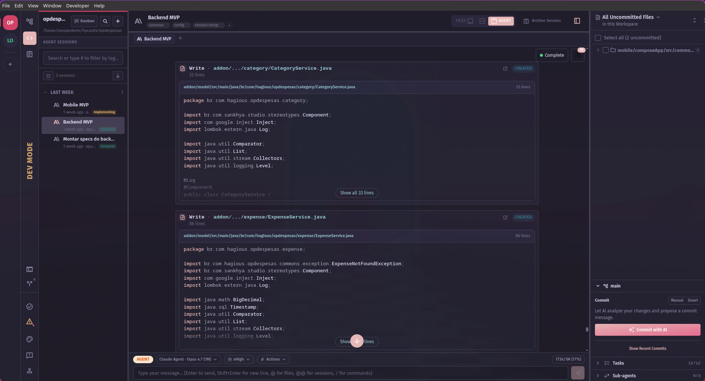
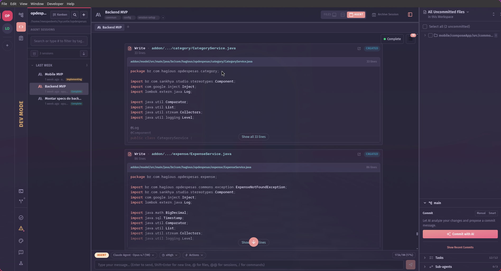
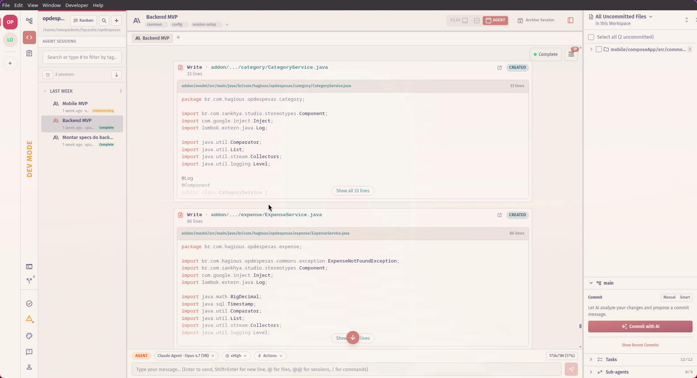

<p align="center">
    
    <h2 align="center">Rosé Pine for Nimbalyst</h2>
</p>

<p align="center">All natural pine, faux fur and a bit of soho vibes for the classy minimalist</p>

<p align="center">
    <a href="https://github.com/rose-pine/rose-pine-theme">
        
    </a>
</p>

## Usage

### Linux

```bash
mkdir -p ~/.config/@nimbalyst/electron/extensions
git clone https://github.com/omartelo/rose-pine-nimbalyst.git \
  ~/.config/@nimbalyst/electron/extensions/rose-pine
```

### macOS

```bash
mkdir -p ~/Library/Application\ Support/@nimbalyst/electron/extensions
git clone https://github.com/omartelo/rose-pine-nimbalyst.git \
  ~/Library/Application\ Support/@nimbalyst/electron/extensions/rose-pine
```

### Windows (PowerShell)

```powershell
$dir = "$env:APPDATA\@nimbalyst\electron\extensions"
New-Item -ItemType Directory -Force -Path $dir | Out-Null
git clone https://github.com/omartelo/rose-pine-nimbalyst.git "$dir\rose-pine"
```

Then:

1. Restart Nimbalyst.
2. Open **Settings → Extensions** and confirm **Rosé Pine** is enabled.
3. Open the theme picker in the navigation gutter and select one of the variants.

## Gallery

### Rosé Pine



### Rosé Pine Moon



### Rosé Pine Dawn



## Thanks to

- [omartelo](https://github.com/omartelo) — port author
- [Rosé Pine contributors](https://github.com/rose-pine) — original palette

## Contributing

This is a Nimbalyst extension and ships as a single `manifest.json` aggregating all three variants under `contributions.themes[]`. Because the Nimbalyst extension shape is one manifest with an array of themes — and the official [`@rose-pine/build`](https://github.com/rose-pine/build) tool emits one file per variant — the upstream build pipeline doesn't apply here. Colors are edited directly in `manifest.json`.

To propose a tweak:

1. Fork the repo.
2. Edit the relevant variant block under `contributions.themes[]`.
3. Validate: `jq . manifest.json`.
4. Open a PR.

Palette reference: [rose-pine/palette](https://github.com/rose-pine/palette).

## License

[MIT](./LICENSE)
